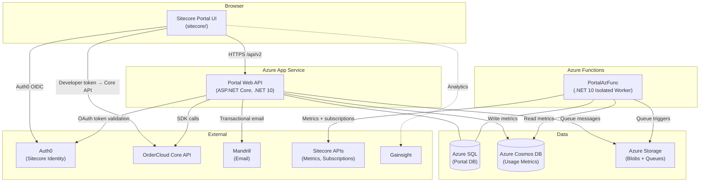

# OrderCloud Portal (Devcenter)

**Service:** `ordercloud.portal`  
**Product Owner:** @Miranda Danielson  
**Architect:** @Jeff Ilse, @Robert Watt  
**JIRA:** [OCP Board](https://sitecore.atlassian.net/jira/software/c/projects/OCP/boards/640)  
**Last Updated:** 2026-08-05  
**Lifecycle:** Production  
**Type:** Web App (React SPA) + REST API (ASP.NET Core) + Azure Functions Worker

---

## Table of Contents

1. [Quick Reference](#quick-reference)
2. [Overview](#overview)
3. [Architecture](#architecture)
4. [Components](#components)
   - [Sitecore Portal UI (`/sitecore`)](#sitecore-portal-ui-sitecore)
   - [Portal Web API (`/api/webapi`)](#portal-web-api-apiwebapi)
   - [Azure Functions Worker (`/api/PortalAzFunc`)](#azure-functions-worker-apiportalazfunc)
5. [API Specification — v1 (Legacy)](#api-specification--v1-legacy)
   - [Authentication](#authentication-oauthcontroller)
   - [Registration](#registration-registrationcontroller)
   - [Me](#me-mecontroller)
   - [Organizations](#organizations-organizationscontroller)
   - [Teams](#teams-teamscontroller)
   - [Usage Metrics](#usage-metrics-usagemetricscontroller)
   - [OIDC / Social Login](#oidc--social-login-openidconnectcontroller)
   - [Environment](#environment-envcontroller)
6. [API Specification — v2 (Current)](#api-specification--v2-current)
7. [Data Model](#data-model)
8. [Authentication & Authorization](#authentication--authorization)
9. [Configuration & Settings](#configuration--settings)
10. [Background Jobs](#background-jobs)
11. [Operations](#operations)
12. [Known Issues & Deprecations](#known-issues--deprecations)

---

## Quick Reference

> The OrderCloud Portal is the web-based management interface for the [OrderCloud](https://ordercloud.io) platform. It allows developers and Sitecore customers to manage their OrderCloud organizations (marketplaces), API clients, role groups, search indexes, staging environments, usage metrics, and to explore the OrderCloud API via a built-in console.

**Base URL (Production):** `https://portal.ordercloud.io`  
**Base URL (QA):** `https://portal.ordercloud-qa.com`  
**Base URL (Staging):** `https://portal.ordercloud-staging.com`

**API v1 base path:** `/api/v1` — authenticated with native OC JWT (legacy developer API; also used by server-to-server callers)  
**API v2 base path:** `/api/v2` — authenticated with Sitecore Identity JWT (Auth0); consumed by the Sitecore Portal UI

**UI:** Sitecore Portal UI at `/sitecore` (React + Vite + Auth0) — the sole frontend  
**Sunset:** OG Portal UI (`/src`, CRA + Material-UI) was removed from the repo (OCP-1258) after the April 30, 2026 shutdown

**Data sensitivity:** Contains developer PII (email, username), Sitecore org IDs, OAuth tokens (refresh tokens stored in DB)

---

## Overview

The OrderCloud Developer Portal (internally: "Devcenter") is the self-service management console for the OrderCloud commerce platform. All interactive UI traffic goes through the Sitecore Portal UI. It serves two primary user personas:

1. **OrderCloud Developers / Sitecore customers** — Authenticate via Auth0 (Sitecore Identity), manage marketplace configuration, role groups, API clients, search indexes, subscriptions, staging/restore, and explore/execute OrderCloud API calls via the built-in API Console and Admin resource browser.
2. **Sitecore SaaS ops (internal admin)** — Direct API calls to `api/v2/marketplaces` and related SaaS ops routes using Native OC JWT with the `SCAdmin` flag.

### What it does

- **Marketplace management**: Marketplace overview and rename, role groups (create/edit/delete/`ScRole`), API clients, user access, staging restore webhooks
- **Self-service tools**: Search index rebuild/monitor, entity sync (catalogs, orders, buyers, suppliers, users, categories, inventory, product sync), subscription processing, staging restore webhook config
- **API Console** (`/console`, Beta): Multi-tab OpenAPI explorer against OrderCloud Core; impersonation; request history; mobile-responsive shell; versioned localStorage persistence
- **Admin / Buyer User Tool** (`/admin`, Beta): Resource browser for marketplace entities (API clients, security profiles, buyers, suppliers, products, orders, and nested assignments)
- **Homepage**: Welcome/context cards, announcements/notifications popover (remote feed with local fallback), changelog link, role-aware shortcuts (`FullAccess` bypass)
- **Usage metrics**: Collect and report usage metrics to Sitecore entitlement systems (including top-resource and duration metrics)
- **Sync / Envoy operations**: Marketplace Sitecore data sync and role-group sync (including dry-run), post QA/Staging restore sync
- **Legacy developer API (v1)**: Registration, email verification, password flows, OAuth social login (GitHub, Google), org/team management — retained without the OG Portal UI; see [OCP-1261 audit](../api/docs/OCP-1261-legacy-api-audit.md)

### Who uses it

| User Type | Interface | Auth |
|-----------|-----------|------|
| Sitecore customers / marketplace operators | Sitecore Portal UI (`/sitecore`) | Auth0 / Sitecore Identity → `/api/v2`; developer token from `/api/v2/marketplace/token` for OrderCloud Core calls |
| Sitecore SaaS ops (internal admin) | Direct API calls to `api/v2/marketplaces` | Native OC JWT with SCAdmin flag |
| Server-to-server (Core restore, metrics ingest) | Portal API v1 | HMAC / unauthenticated ingest as documented per route |

---

## Architecture

### System Interactions

| Direction | System | Protocol | Purpose |
|-----------|--------|----------|---------|
| Outbound | OrderCloud Core API | HTTPS / REST (Four51.EnvManagementSDK + `ordercloud-javascript-sdk` from UI) | Provision/manage org environments; UI console & admin resource calls |
| Outbound | Sitecore Identity (Auth0) | OIDC / OAuth2 | Token validation for v2 API; client credentials for service-to-service calls |
| Outbound | Mandrill (Mailchimp) | HTTPS REST | Transactional email (registration, password reset, confirmations) |
| Outbound | Sitecore Usage Metrics API | HTTPS REST | Report entitlement metrics |
| Outbound | Sitecore Subscriptions API | HTTPS REST | Sync subscription IDs |
| Outbound | Sitecore Inventory API | HTTPS REST | Sync inventory records |
| Outbound | Gainsight | Browser script | Product analytics / identify (Sitecore Portal UI) |
| Inbound (Sitecore Portal UI) | Auth0 | OIDC redirect | User authentication for Sitecore Portal UI |
| Inbound | Announcements feed | HTTPS (`VITE_APP_ANNOUNCEMENTS_URL`) | Homepage / notifications popover content (falls back to bundled defaults) |
| Data | Azure SQL (Portal DB) | TCP / Managed Identity | Primary relational data store |
| Data | Azure Cosmos DB | HTTPS | Usage metrics data store — written by Portal API and read/processed by Azure Functions for Sitecore entitlement reporting |
| Data | Azure Storage (Blobs + Queues) | HTTPS / Managed Identity | Async job payloads (queue messages reference blob files) |
| Data | Azure App Configuration | HTTPS / Managed Identity | Runtime configuration, secrets via Key Vault references |
| Monitoring | Application Insights | SDK | Telemetry, logs, traces |

### Deployment

Infrastructure is maintained in the **[`ordercloud.infrastructure.provisioning`](https://ordercloud.visualstudio.com/OC-Platform/_git/AzureOC?path=/.github/service-context.md)** repository. See its service context for full IaC details.

- **Web API**: Azure App Service (hostnames: `ocportal.azurewebsites.net`, `oc-portalqa.azurewebsites.net`, etc.). No longer serves a co-located SPA — the OG Portal static frontend was removed with OCP-1258.
- **Sitecore Portal UI**: Hosted separately (hostnames: `ordercloud.sitecorecloud.io`, `ordercloud-staging.sitecore-staging.cloud`). Calls the Portal API at `/api/v2`.
- **Azure Functions**: Deployed as a separate Azure Functions v4 app (isolated worker model, .NET 10).
- **Database**: Azure SQL (Azure SQL Database), managed via DACPAC deployment through `DeployUtil`.



---

## Components

### Sitecore Portal UI (`/sitecore`)

**Status: Active — sole frontend.**

React SPA (Vite + TypeScript). Replaced the sunset OG Portal and is the only in-repo UI.

**Tech Stack:**
- React 18, TypeScript, Vite
- Chakra UI v2 + Sitecore Blok theme (`@sitecore/blok-theme`)
- Auth0 React SDK (`@auth0/auth0-react`) — authentication
- TanStack Router v1 — client-side routing
- TanStack Query v5 (+ persist client / sync storage persister) — server state; console tab and locked-parameter state is **versioned** in localStorage (OCP-1321)
- Axios — HTTP client (authenticated via `AuthenticatedAxiosProvider`)
- `ordercloud-javascript-sdk` — OrderCloud Core API calls from Console / Admin
- `@sitecore-ui/portal-singular` — Sitecore shared UI / token claim helpers
- Gainsight — product analytics (`config/gainsight.config.ts`)
- pnpm — package manager; Vitest for unit/component tests (OCP-1201)

**Authentication flow:**
1. User is redirected to Auth0 (Sitecore Identity domain).
2. Auth0 returns an ID token + access token.
3. The access token is sent as a Bearer token on all `/api/v2` calls.
4. The API validates the token against Sitecore Identity (OIDC JWT validation).
5. Sitecore tenant context is derived from claims in the token (`ScTenantId`, `ScOrgId`, etc.).
6. For OrderCloud Core calls (Console, Admin, resource lists), the UI obtains a short-lived **developer token** via `GET /api/v2/marketplace/token` and uses it with the Core API URL for the marketplace’s region/environment.

**In-memory vs localStorage token cache:**
- On Sitecore-hosted domains (`ordercloud.sitecorecloud.io`, `ordercloud-staging.sitecore-staging.cloud`): uses in-memory cache (reduced XSS blast radius; silent auth works reliably same-site).
- On other hosts (local dev, custom): uses `localStorage` to survive page refreshes when silent auth is blocked by the browser.

**Key environment targets:**

| Environment | Hostname | Portal API Base URL |
|-------------|----------|---------------------|
| Dev/QA | `ordercloud-staging.sitecore-staging.cloud` | `https://portal.ordercloud-qa.com/api/v2` |
| Staging | `ordercloud-staging.sitecore-staging.cloud` | `https://portal.ordercloud-staging.com/api/v2` |
| Production | `ordercloud.sitecorecloud.io` | `https://portal.ordercloud.io/api/v2` |

**Major routes / features:**

| Area | Path | Notes |
|------|------|-------|
| Home | `/` | Marketplace context, role-aware shortcuts, announcements, changelog |
| API Console | `/console` | Beta — multi-tab OpenAPI explorer, impersonation, request history, mobile shell (OCP-1218, OCP-1309, OCP-1312) |
| Marketplace roles | `/roles` | Role group CRUD; Portal ID labels; rename support |
| Self-service | `/self-service/*` | Index tools, sync tools, subscriptions, staging restore |
| Admin (BUT) | `/admin/*` | Beta — resource browser for marketplace entities and assignments |

**Self-service tools** (`/self-service`):
- **Index tools** — list/rebuild search indexes; progress/status UI
- **Sync tools** — entity sync (catalogs, orders, buyers, suppliers, users, categories, inventory records, product sync catalog)
- **Subscriptions** — process subscriptions
- **Staging restore** — webhook get/save/delete/test

**API Console highlights:**
- Multi-tab architecture with editable tab names and per-operation form snapshots
- OpenAPI-driven resource navigation; `FullAccess` role bypasses operation role gates
- Impersonation workflow (desktop + mobile bottom sheet)
- Aggregate request history; mobile explore / history swipe drawers
- Versioned persistence for tabs and locked parameters (legacy keys migrated safely)

**Homepage / chrome:**
- Announcements + notifications popover (OCP-1308); remote JSON feed via `VITE_APP_ANNOUNCEMENTS_URL` with bundled fallback
- App switcher, marketplace switching (local), standardized avatar/display name (OCP-1319)
- Gainsight identify / global context

**Removed from this UI (do not document as current):**
- Content Hub ONE / CH1 homepage article feeds (OCP-1249)
- Algolia doc search (was OG Portal–only)
- Any dependency on `@ordercloud/portal-javascript-sdk` or the deleted `/src` CRA app

---

### Portal Web API (`/api/webapi`)

**ASP.NET Core web API, .NET 10.** Serves JSON APIs only (no co-located SPA).

The API is split into two versioned route namespaces:

#### `api/v1` — Legacy developer endpoints (`Controllers/api/`)
Authenticated via **native OC JWT** (`AUTH_SCHEME_NATIVEOC`). Used for registration/OAuth/org/team management and confirmed server-to-server routes (`POST /api/v1/metrics`, `POST /api/v1/env/restore`). The OG Portal UI that primarily called these routes was removed; most endpoints remain retained pending further cleanup ([OCP-1261](../api/docs/OCP-1261-legacy-api-audit.md)).

#### `api/v2` — Current endpoints (`Controllers/sitecoreapi/`)
Authenticated via **Sitecore Identity JWT** (`AUTH_SCHEME_SITECORE`). Used by the Sitecore Portal UI. Scoped to the authenticated Sitecore tenant (`ScAuthContext`).

#### Shared / unauthenticated endpoints
- Registration, email verification, password flows (`/api/v1/register`, `/api/v1/verify`, etc.) — no auth required
- OAuth token grant/revoke (`/api/v1/oauth/token`, `/api/v1/oauth/revoke`)
- OIDC callback (`IdpService.OIDC_CODE_ROUTE`)
- Health check (`/health`)
- Build number (`/api/v1/env`)

**Project structure:**
```
api/
  Common/             # Shared services, queries, models, DB layer (Dapper + SQL)
  webapi/             # ASP.NET Core host, Startup, Controllers
    Controllers/
      api/            # v1 controllers (native OC auth)
      sitecoreapi/    # v2 controllers (Sitecore auth)
  PortalDb/           # SQL Server database project (DACPAC)
  PortalAzFunc/       # Azure Functions worker
  PortalTests/        # xUnit integration tests
  DeployUtil/         # CI/CD tooling: DB bootstrap, Azure provisioning
  docs/               # Internal audits / notes (e.g. OCP-1261 legacy API audit)
```

---

### Azure Functions Worker (`/api/PortalAzFunc`)

Azure Functions v4, isolated worker model, .NET 10. Runs background jobs triggered by timers and Azure Storage Queues. Shares the `Common` project with the web API.

**Queue message pattern:** Large payloads are stored as Blob files; the queue message contains only the blob filename. The function reads the file from the `asyncservicefiles` blob container.

---

## API Specification — v1 (Legacy)

> Legacy developer and server-to-server API. Authentication (where required): `Bearer <nativeOC_JWT>`. The interactive OG Portal UI is gone; treat new product UI work as `/api/v2` only. Endpoint retention status is tracked in [`api/docs/OCP-1261-legacy-api-audit.md`](../api/docs/OCP-1261-legacy-api-audit.md).

### Authentication (`OauthController`)

| Method | Route | Description |
|--------|-------|-------------|
| POST | `api/v1/oauth/token` | Password grant and refresh token grant. Returns `access_token` + `refresh_token`. |
| POST | `api/v1/oauth/revoke` | Revoke a refresh token. |

### Registration (`RegistrationController`)

| Method | Route | Auth | Description |
|--------|-------|------|-------------|
| POST | `api/v1/register` | None | Register a new developer (sends verification email). |
| POST | `api/v1/verify` | None | Verify registration code; returns `User` object. |
| POST | `api/v1/forgotpassword` | None | Initiate forgotten-password flow (sends email). |
| POST | `api/v1/resetpassword` | None | Reset password using code from email. |
| GET | `api/v1/portalusers` | NativeOC | List portal users (admin use). Query: `search` (required), `page`, `pagesize`. |
| GET | `api/v1/portalusers/{username}` | NativeOC | Get a specific portal user by username. |
| POST | `api/v1/unlock` | None | Self-service account unlock. Body: `SelfServiceUnlock` (Email, Code). |

### Me (`MeController`)

| Method | Route | Description |
|--------|-------|-------------|
| GET | `api/v1/me` | Get the authenticated developer's profile. |
| PUT | `api/v1/me` | Update the authenticated developer's profile. Body: `User` (email is ignored; use `/me/email`). |
| PUT | `api/v1/me/password` | Change password. Body: `PasswordUpdate` (CurrentPassword, NewPassword, RefreshToken, Recaptcha). Revokes all existing sessions. |
| PUT | `api/v1/me/email` | Change email. Body: `EmailUpdate` (Email, Password, Recaptcha). Triggers email verification flow. |
| POST | `api/v1/me/accept` | Accept terms and conditions. |
| POST | `api/v1/me/verifyemail` | Re-trigger email verification for the current address. Body: `RecaptchaRequest`. |
| GET | `api/v1/me/regions` | List regions the dev has access to. Query: `page`, `pagesize`. |
| GET | `api/v1/me/orginvites` | List pending direct org invites. |
| POST | `api/v1/me/orginvites/{id}/accept` | Accept an org invite. |
| POST | `api/v1/me/orginvites/{id}/decline` | Decline a direct org invite. |
| GET | `api/v1/me/orgteaminvites` | List pending org invites via team assignment. |
| GET | `api/v1/me/authorizationmethods` | List OIDC/password authorization methods linked to the account. |
| DELETE | `api/v1/me/authorizationmethods/{name}` | Unlink an authorization method (e.g., `Github`, `Google`, `Password`). Requires at least one method to remain. |
| POST | `api/v1/me/authorizationmethods/{name}/link` | Initiate OAuth flow to link an external IdP to the current account. Returns `{ RedirectUrl }`. |

### Organizations (`OrganizationsController`)

| Method | Route | Description |
|--------|-------|-------------|
| GET | `api/v1/organizations` | List orgs. Query: `Owner.Username`, `search`, `sortby`, `environment`, `Region.Id`, `page`, `pagesize`. |
| GET | `api/v1/organizations/{id}` | Get org detail. |
| GET | `api/v1/organizations/{id}/ApiClients` | List API clients for org. Query: `allowseller`, `allowanybuyer`, `allowanysupplier`, `isanonbuyer`, `search`, `page`, `pagesize`. |
| GET | `api/v1/organizations/{id}/ApiClients/{apiclientid}/users` | List users with access via a specific API client. Query: `search`, `page`, `pagesize`. |
| GET | `api/v1/organizations/{id}/token` | Get impersonation token. Query: `username`, `clientid`. |
| GET | `api/v1/organizations/{id}/contributors` | List all contributors (direct + via team). |
| GET | `api/v1/organizations/{id}/contributors/{username}` | Get contributor detail. |
| DELETE | `api/v1/organizations/{id}` | Delete org (sends confirmation email). |
| POST | `api/v1/organizations/{id}/transfer` | Transfer org ownership to another user. |
| GET | `api/v1/organizations/{id}/stagingrestorewebhook` | Get staging restore webhook config. |
| PUT | `api/v1/organizations/{id}/stagingrestorewebhook` | Save staging restore webhook. |
| DELETE | `api/v1/organizations/{id}/stagingrestorewebhook` | Delete staging restore webhook. |
| POST | `api/v1/organizations/{id}/stagingrestorewebhook/test` | Test fire staging restore webhook. |
| POST | `api/v1/confirmation` | Confirm a pending action using a confirmation code. |
| GET | `api/v1/organizations/{id}/searchindexes` | List search indexes. Query: `type`, `status`. |
| GET | `api/v1/organizations/{id}/searchindexes/{indexID}/errors` | List search index errors. |
| POST | `api/v1/organizations/{id}/searchindexes/{type}/rebuild` | Rebuild a search index. Body: `RebuildIndex`. |
| POST | `api/v1/organizations/{id}/processsubscriptions` | Process subscriptions for an org. Body: `ProcessSubscriptions` (id, Recaptcha). |
| GET | `api/v1/organizations/{id}/entitysyncmetadata` | Get entity sync metadata. Returns `EntitySyncModelsResponse`. |
| POST | `api/v1/organizations/{id}/synchronizeproductsynccatalog` | Product sync catalog (preferred route name). Body: `SyncCatalog` (CatalogID, CategoryID, Recaptcha). |
| POST | `api/v1/organizations/{id}/synchronizecatalog` | Alias of `synchronizeproductsynccatalog`. |
| POST | `api/v1/organizations/{id}/synchronizecatalogs` | Sync **catalogs** entity set (distinct from product sync). Body: `EntitySyncBase`. |
| POST | `api/v1/organizations/{id}/synchronizeorders` | Sync orders. Body: `SyncOrders` (StartDate, EndDate, Recaptcha). |
| POST | `api/v1/organizations/{id}/synchronizecategories` | Sync categories. Body: `SyncCategories` (Catalog, Recaptcha). |
| POST | `api/v1/organizations/{id}/synchronizeadminusers` | Sync admin users. Body: `SyncUsers`. |
| POST | `api/v1/organizations/{id}/synchronizesuppliers` | Sync suppliers. Body: `EntitySyncBase`. |
| POST | `api/v1/organizations/{id}/synchronizeinventoryrecords` | Sync inventory records. Body: `SyncInventoryRecords` (CatalogID, ProductID, Recaptcha). |
| POST | `api/v1/organizations/{id}/synchronizebuyers` | Sync buyers. Body: `EntitySyncBase`. |
| POST | `api/v1/organizations/{id}/synchronizebuyerusers` | Sync buyer users. Body: `SyncUsers` (CompanyID, Recaptcha). |
| POST | `api/v1/organizations/{id}/synchronizesupplierusers` | Sync supplier users. Body: `SyncUsers` (CompanyID, Recaptcha). |
| POST | `api/v1/organizations/{id}/synchronizebuyerusergroups` | Sync buyer user groups. Body: `SyncBuyerUserGroups` (BuyerID, Recaptcha). |
| PUT | `api/v1/organizations/{id}` | Save (upsert) an org. Body: `Org`. |

**Access management on orgs:**

| Method | Route | Description |
|--------|-------|-------------|
| GET | `api/v1/organizations/{id}/access/users` | List direct user assignments for org. |
| GET | `api/v1/organizations/{id}/access/teams` | List direct team assignments for org. |
| PUT | `api/v1/organizations/{id}/access/teams/{teamId}` | Save team access to org. |
| PUT | `api/v1/organizations/{id}/access/users/{username}` | Save user access to org. |
| DELETE | `api/v1/organizations/{id}/access/users/{username}` | Delete direct user access from org. |
| DELETE | `api/v1/organizations/{id}/access/teams/{teamId}` | Delete team access from org. |

### Teams (`TeamsController`)

| Method | Route | Description |
|--------|-------|-------------|
| GET | `api/v1/teams` | List teams. Query: `Owner.Username`, `search`, `sortby`, `page`, `pagesize`. |
| GET | `api/v1/teams/{id}` | Get team detail. |
| PUT | `api/v1/teams/{id}` | Save (upsert) team. Body: `Team`. |
| DELETE | `api/v1/teams/{id}` | Delete team (confirmation code emailed). |
| GET | `api/v1/teams/{id}/members` | List team members. Query: `page`, `pagesize`, `search`. |
| GET | `api/v1/teams/{id}/members/{username}` | Get specific team member. |
| PUT | `api/v1/teams/{id}/members/{username}` | Invite/add team member. Body: `TeamMember` (IsAdmin). |
| DELETE | `api/v1/teams/{id}/members/{username}` | Remove team member. |
| POST | `api/v1/teams/{id}/transfer` | Transfer team ownership. Body: `User` (Username). |
| GET | `api/v1/me/teaminvites` | List pending team invites for the authenticated user. |
| POST | `api/v1/me/teaminvites/{id}/accept` | Accept a team invite. |
| POST | `api/v1/me/teaminvites/{id}/decline` | Decline a team invite. |
| GET | `api/v1/teams/{id}/orginvites` | List org invites for a team. |
| POST | `api/v1/teams/{id}/orginvites/{orgid}/accept` | Accept org invite for a team. |
| POST | `api/v1/teams/{id}/orginvites/{orgid}/decline` | Decline an org invite for a team. |
| GET | `api/v1/teams/{id}/access` | List accepted org access assignments for a team. |
| GET | `api/v1/teams/globalsearch` | Global team search. |

### Usage Metrics (`UsageMetricsController`)

| Method | Route | Description |
|--------|-------|-------------|
| POST | `api/v1/metrics` | Store usage metrics payload. Body: `UsageMetricsPayload` (raw JSON body). Server-to-server; retained. |

### OIDC / Social Login (`OpenIdConnectController`)

| Method | Route | Description |
|--------|-------|-------------|
| GET | `[IdpService.OIDC_CODE_ROUTE]` | OAuth2 authorization code callback from external IdP (GitHub, Google). Uses `OC_OIDC_CID` cookie for CSRF correlation. |

### Environment (`envController`)

| Method | Route | Auth | Description |
|--------|-------|------|-------------|
| GET | `api/v1/env` | None | Returns `{ BuildNumber }`. Used by UI to validate spec freshness. |
| POST | `api/v1/env/restore` | Signed (x-oc-hash) | Called by OrderCloud Core when a staging/QA restore completes. Validates HMAC signature, then deletes QA orgs by region (QA) or queues staging webhooks (Staging), and enqueues post-restore Sitecore sync (`sync-sc-qa-restore` or `sync-sc-staging-restore`). |

---

## API Specification — v2 (Current)

> These endpoints are used by the **Sitecore Portal UI** and the Sitecore integration. Authentication: `Bearer <Sitecore_Identity_JWT>`. The token is validated against `SitecoreBase.IdentityBaseUrl`. Tenant context is extracted from JWT claims.

### Current User / Marketplace (`SitecoreController`)

| Method | Route | Description |
|--------|-------|-------------|
| GET | `api/v2/me` | Get current authenticated user context: `ScOrgId`, `ScTenantId`, `ScRoles`, `OrgAdmin`, `ScPermissionGrants`, `OcRoles`. |
| GET | `api/v2/marketplace` | Get marketplace details (name, region, environment, Salesforce account ID, etc.). |
| PATCH | `api/v2/marketplace` | Update marketplace name. Requires `OrgAdmin`. Body: `{ Name, TenantId? }`. |
| GET | `api/v2/marketplace/token` | Get impersonation / developer token for OrderCloud Core. Query: `username`, `clientid`. |

### Marketplace Roles (`SitecoreController`)

| Method | Route | Description |
|--------|-------|-------------|
| GET | `api/v2/marketplace/roles` | List marketplace role groups. |
| GET | `api/v2/marketplace/roles/{id}` | Get a marketplace role group. |
| PUT | `api/v2/marketplace/roles/{id}` | Save marketplace role group. Requires `OrgAdmin` or `RoleGroupsAdmin`. Body: `ScRole`. |

**`ScRole` fields:** `Name`, `InteropId`, `ImpersonateBuyer`, `ImpersonateSeller`, `ImpersonateSupplier`, `IndexAdmin`, `SyncAdmin`, `SubscriptionAdmin`, `RoleGroupsAdmin`, `StagingRestoreAdmin`

### API Clients (`SitecoreController`)

| Method | Route | Description |
|--------|-------|-------------|
| GET | `api/v2/ApiClients` | List API clients. Query: `allowseller`, `allowanybuyer`, `allowanysupplier`, `isanonbuyer`, `search`, `page`, `pagesize`. |
| GET | `api/v2/ApiClients/{apiclientid}/users` | List users with access via a specific API client. Query: `search`, `page`, `pagesize`. |

### Search Indexes (`SitecoreController`)

| Method | Route | Description |
|--------|-------|-------------|
| GET | `api/v2/searchindexes` | List search indexes. Query: `type`, `status`. |
| GET | `api/v2/searchindexes/{indexID}/errors` | List errors for a specific search index. |
| POST | `api/v2/searchindexes/{type}/rebuild` | Rebuild a search index. Body: `RebuildIndex` (id, Recaptcha). |

### Subscriptions (`SitecoreController`)

| Method | Route | Description |
|--------|-------|-------------|
| POST | `api/v2/processsubscriptions` | Process subscriptions for the marketplace. Body: `ProcessSubscriptions` (id, Recaptcha). |

### Staging Restore Webhook (`SitecoreController`)

| Method | Route | Description |
|--------|-------|-------------|
| GET | `api/v2/stagingrestorewebhook` | Get staging restore webhook config for the marketplace. |
| PUT | `api/v2/stagingrestorewebhook` | Save staging restore webhook. Body: `StagingRestoreWebhook`. |
| DELETE | `api/v2/stagingrestorewebhook` | Delete staging restore webhook. |
| POST | `api/v2/stagingrestorewebhook/test` | Test fire the staging restore webhook. |

### Sync Operations (`SitecoreController`)

| Method | Route | Description |
|--------|-------|-------------|
| POST | `api/v2/synchronizeproductsynccatalog` | Product sync catalog (preferred). Body: `SyncCatalog`. Also aliased as `api/v2/synchronizecatalog`. |
| POST | `api/v2/synchronizecatalog` | Alias of `synchronizeproductsynccatalog`. |
| POST | `api/v2/synchronizecatalogs` | Sync **catalogs** entity set (OCP-1234). Body: `EntitySyncBase`. |
| POST | `api/v2/synchronizebuyerusers` | Sync buyer users. Body: `SyncUsers` (CompanyID, Recaptcha). |
| POST | `api/v2/synchronizesupplierusers` | Sync supplier users. Body: `SyncUsers`. |
| POST | `api/v2/synchronizeadminusers` | Sync admin users. Body: `SyncUsers`. |
| POST | `api/v2/synchronizesuppliers` | Sync suppliers. Body: `EntitySyncBase` (Recaptcha). |
| POST | `api/v2/synchronizeorders` | Sync orders. Body: `SyncOrders`. |
| POST | `api/v2/synchronizecategories` | Sync categories. Body: `SyncCategories`. |
| POST | `api/v2/synchronizeinventoryrecords` | Sync inventory records. Body: `SyncInventoryRecords` (CatalogID, ProductID, Recaptcha). |
| POST | `api/v2/synchronizebuyers` | Sync buyers. Body: `EntitySyncBase` (Recaptcha). |
| POST | `api/v2/synchronizebuyerusergroups` | Sync buyer user groups. Body: `SyncBuyerUserGroups` (BuyerID, Recaptcha). |
| GET | `api/v2/entitysyncmetadata` | Get entity sync metadata. Returns `EntitySyncModelsResponse`. |

### Internal / SaaS Ops (`SitecoreSaaSopsController`)

> **Note:** These endpoints use `AUTH_SCHEME_NATIVEOC` (not Sitecore JWT) and require `SCAdmin` privilege. They are used by internal Sitecore SaaS operations tooling, not by the end-user portal.

| Method | Route | Auth | Description |
|--------|-------|------|-------------|
| POST | `api/v2/marketplaces` | NativeOC + SCAdmin | Create/provision a new marketplace (ScTenant + Org). Body: `ScMarketplace` (SCOrgId, Name, SalesforceAccountId, SCSubscriptionId, Region.Id, OcEnvironment). OcEnvironment must be `Production` or `Sandbox`. |
| GET | `api/v2/marketplaces/{tenantid}` | NativeOC + SCAdmin | Get a marketplace by Sitecore tenant ID. |
| DELETE | `api/v2/marketplaces/{tenantid}` | NativeOC + SCAdmin | Delete a marketplace and its associated ScTenant record. |
| POST | `api/v2/scadmin/linkexisting` | NativeOC + SCAdmin | Link an existing OC org to a Sitecore tenant (migration utility). Body: `TempLinkMarketplace`. |
| POST | `api/v2/scadmin/sctoken` | NativeOC + SCAdmin | Get a Sitecore Identity service token via client credentials. Returns `TokenResponse`. |

---

## Data Model

### Primary Store: Azure SQL (`Portal` database)

The schema is managed via DACPAC (`api/PortalDb/`), deployed through `DeployUtil`.

#### Core Tables

**`Dev`** — Registered developer accounts. Includes credentials (BCrypt hash, legacy hash), social OAuth subs (Google, GitHub), login attempt tracking, email verification, terms acceptance, and `SCAdmin` flag for Sitecore internal admins.

**`RefreshToken`** — Active refresh tokens (token value, DevId FK, issued/last-used timestamps).

**`Registration`** — Pending email verifications (Email PK, short verification code, creation timestamp).

**`ActionConfirmation`** — Pending destructive action confirmations (delete org, transfer org, etc.). Stores a short code emailed to the user, expiry, and a serialized delegate to invoke on confirm.

**`Org`** — OrderCloud organizations. Includes `InteropId` (unique ID used in OC Core), `OcCoreDbId`, environment (`Production`/`Staging`/`Sandbox`/`Qa`), region, `OwnerDevId` (NULL for Sitecore-owned orgs), `SCSubscriptionId`, and `SalesforceAccountId`.

**`OrgAssignment`** — Tracks which devs have access to which orgs (and their role)

**`OrgAssignmentRole`** — Roles applicable to org assignments

**`Team`** — Developer teams

**`TeamMember`** — Team membership records

**`Region`** — Available OrderCloud deployment regions. Stores per-environment URLs, JWT signing keys, `AllowAllDevsSandbox` flag, and `UsageMetricsInvocationHour` (a **CST** hour value compared against `DateTime.Now.ToCST().Hour` in the Azure Function to determine which region to process).

**`DevRegionAccess`** — Per-region access grants for developers (composite PK: DevId + RegionId). Flags: `CanCreateQa`, `CanCreateProduction`, `CanCreateSandbox`.

**`ScTenant`** — Links a Sitecore tenant (`Id` PK, `ScOrgId`) to an OrderCloud org (`OcOrgId` FK → Org).

**`ScRole`** — Marketplace role groups for Sitecore tenants. Scoped to a `ScTenantId`. Includes `Name`, `InteropId`, and permission flags: `ImpersonateBuyer`, `ImpersonateSeller`, `ImpersonateSupplier`, `IndexAdmin`, `SyncAdmin`, `SubscriptionAdmin`, `RoleGroupsAdmin`, `StagingRestoreAdmin`.

**`ScRoleOcOrgRole`** — Maps ScRole to OrderCloud org roles

**`Roles`** — OrderCloud role names (lookup table, used for test setup)

**`OIDC`** — OIDC provider configurations

**`OIDCDev`** — Links a developer to an OIDC provider (`OIDCId`, `DevId`, `Sub`)

**`OIDCStateToken`** — OIDC flow state tokens (cleaned up hourly by Azure Function)

**`StagingRestoreWebhook`** — Staging restore webhook configurations per org

**`MissingInCore`** — Reconciliation/diagnostic table. Stores Portal orgs that have no corresponding record in OrderCloud Core. Fields: `OcCoreDbId`, `OrgId`, `OrgInteropId`, `OrgName`. Used to surface data integrity gaps between the portal DB and OC Core.

#### Metric Tables

**`MetricOrder`**, **`MetricParty`**, **`MetricCatalog`**, **`MetricConfiguration`**, **`MetricUsage`** — Core usage metrics storage. Written by the Portal API and aggregated via the `vMetrics` view for Sitecore entitlement reporting.

**`MetricTopProduct`**, **`MetricTopPromotion`**, **`MetricTopCompany`** (OCP-1227) — Top-resource metrics (products sold, promotions, buyers/suppliers). Overwritten per org/day when metrics are re-reported. Included in org delete cascade.

Additional fields surfaced on `vMetrics` / Cosmos docs (Env SDK 3.0.5+): Average Checkout Duration, Average Fulfillment Duration, Revenue Awaiting Approval, Unsubmitted Orders, Active Users, Discounts, plus the top-resource collections above.

#### Views

**`vDevAccess`** — Joins Dev, OrgAssignment, Org, Region — used for listing dev's accessible orgs with region URLs.

**`vTeamMember`** — Joined team member view.

**`vMetrics`** — Aggregated metrics view (includes top-resource joins loaded in `UsageMetricsQueries`).

### Secondary Store: Azure Cosmos DB

Used for usage metrics data. The Portal API writes metrics data to Cosmos DB; the `SendUsageMetricsToSitecore` Azure Function reads from it to process and report entitlement metrics to Sitecore. Configured via `CosmosDbBase` settings (Endpoint, AccessKey, DatabaseId, ContainerId).

---

## Authentication & Authorization

### v1 API — Native OC Authentication (`AUTH_SCHEME_NATIVEOC`)

- **Grant type:** Password grant (username/password) and refresh token grant
- **Token endpoint:** `POST /api/v1/oauth/token`
- **JWT signing:** Region-specific `PortalJwtKey` (symmetric HMAC)
- **Claims:** `devid` (developer's database ID), `scorgid` (Sitecore org ID if linked)
- **Controller access:** `AuthenticatedDevId` extracted from claims on every request
- **Refresh token:** Stored in `RefreshToken` SQL table; invalidated on `POST /api/v1/oauth/revoke`
- **reCAPTCHA:** Required on login and registration

**Social login (OIDC):** Developers can link GitHub or Google accounts. The OIDC flow uses a correlation cookie (`OC_OIDC_CID`) for CSRF protection. Linked subs are stored in `Dev.GoogleConnectSub` and `Dev.GitHubConnectSub`.

**`QABasicAuth` scheme:** A secondary authentication handler (`AUTH_SCHEME_QABASICAUTH`) is registered for dev/QA use. It checks the `Authorization` header for a hardcoded value and, if matched, injects a `scsaasops` claim — granting SaaS ops access without a JWT. This is registered but does not appear to be wired to any controller; the `QaBaiscAuthSaasOps` config setting likely holds the expected header value.

### v2 API — Sitecore Identity Authentication (`AUTH_SCHEME_SITECORE`)

- **Provider:** Auth0 (Sitecore Identity), validated as OIDC JWT
- **Configuration:** `SitecoreBase.IdentityBaseUrl`, `ValidAuthAudiences`, `ValidIssuers`
- **`ScAuthContext`:** Extracted from JWT claims — includes `ScTenantId`, `ScOrgId`, `OrgAdmin`, `PermissionGrants` (RoleGroupsAdmin, ImpersonateBuyer, etc.), `ScRoles`
- **`OrgAdmin` derivation:** Set to `true` if the token contains any of: `[Organization]\Organization Owner`, `[Organization]\Organization Admin`, or `{tenantId}\[OrderCloud]\Admin` in the `https://auth.sitecorecloud.io/claims/roles` claim array. When `OrgAdmin` is true, all `ScPermissionGrants` flags are implicitly true.
- **`ScRoles`:** Extracted as the set of tenant-scoped role names matching the pattern `{tenantId}\[OrderCloud]\{roleName}` (excluding the `Admin` suffix role).
- **Service-to-service:** Portal API uses client credentials (`IdentityApiClientId` / `IdentityClientSecret`) to call Sitecore APIs
- **Developer / Core token:** Sitecore Portal UI calls `GET /api/v2/marketplace/token` to obtain an OrderCloud JWT used with Core for Console and Admin. OrgAdmin maps to Core `FullAccess`; otherwise mapped OC roles from the Sitecore role groups apply. UI code treats Core role `FullAccess` as a bypass for operation authorization.

### Authorization (v2)

Access to mutating operations is gated by permission flags in `ScAuthContext`:

| Permission | Protects |
|------------|----------|
| `OrgAdmin` | PATCH marketplace name, PUT/DELETE staging webhook, PUT marketplace role, internal marketplace creation. When true, all other permission grants are implicitly true. |
| `RoleGroupsAdmin` | PUT marketplace role (alternative to OrgAdmin) |
| `SyncAdmin` | All sync operations (catalogs, product sync, orders, buyers, suppliers, users, categories, inventory records) |
| `SubscriptionAdmin` | `POST /api/v2/processsubscriptions` |
| `IndexAdmin` | `POST /api/v2/searchindexes/{type}/rebuild` |
| `StagingRestoreAdmin` | PUT/DELETE/test staging restore webhook (v2) |
| `ImpersonateBuyer/Seller/Supplier` | Impersonation token generation (`GET /api/v2/marketplace/token`); also maps to OC roles |
| `IsSaaSops` | Derived from `SCAdmin` claim on a NativeOC token; gates `SitecoreSaaSopsController` |
| `SCAdmin` (NativeOC only) | `SitecoreSaaSopsController` — internal admin operations |

---

## Configuration & Settings

Configuration is loaded at startup via `IoC.BuildAppSettings()`:
1. Environment variables (always applied)
2. Azure App Configuration (loaded via Managed Identity when `AppConfigurationUri` env var is set; Key Vault references resolved automatically)

Key settings (`IAppSettings`):

| Setting | Purpose |
|---------|---------|
| `PortalDbServer` / `PortalDbName` | Azure SQL connection (Managed Identity auth) |
| `PortalDbUser` / `PortalDbPassword` | SQL auth fallback (used in test environments) |
| `PortalJwtKey` | Symmetric key for v1 JWT signing |
| `StorageAccountName` | Azure Storage account (for queues and blobs) |
| `RecaptchaSecretKey` | Google reCAPTCHA server-side key |
| `MandrillKey` | Mandrill API key for email |
| `BaseUrl` | Service's own base URL |
| `SymmetricKey` | General-purpose symmetric encryption key (used for encrypting region signing keys in DB) |
| `ShowStacktraceInError` | If true, includes stack trace in error responses (dev only; disclosure hardened under OCP-1242) |
| `AppInsightsConnStr` | Application Insights connection string |
| `BUILD_NUMBER` | Injected at deploy time; returned by `/api/v1/env` |
| `DefaultRegionName` | Default OC region for new orgs |
| `QaBaiscAuthSaasOps` | Header value for `QABasicAuth` scheme (dev/QA only) |
| `SitecoreBase.IdentityBaseUrl` | Auth0 / Sitecore Identity OIDC authority |
| `SitecoreBase.IdentityApiClientId/Secret` | Client credentials for service-to-service Sitecore calls |
| `SitecoreBase.IdentityAudience` | Audience value for client-credentials token requests (used in `scadmin/sctoken` endpoint) |
| `SitecoreBase.Environment` | Target Sitecore environment name |
| `SitecoreBase.ValidAuthAudiences` | Comma-separated valid JWT audiences for v2 auth |
| `SitecoreBase.UsageMetricsApiBaseUrl` | Sitecore usage metrics reporting endpoint |
| `SitecoreBase.ScSubscriptionsApiBaseUrl` | Sitecore subscriptions sync endpoint |
| `SitecoreBase.InventoryApiBaseUrl` / `InventorySystemId` | Sitecore inventory sync |
| `CosmosDbBase.Endpoint/AccessKey/DatabaseId/ContainerId` | Cosmos DB connection |
| `IsTestEnvironment` | Switches to Azurite emulator for storage |

**Sitecore UI env (Vite):** `VITE_APP_ANNOUNCEMENTS_URL` (optional remote announcements feed), Auth0 / environment selectors in `sitecore/src/config/`.

---

## Background Jobs

All jobs are in `PortalAzFunc` and share the `Common` project.

### Timer-triggered (scheduled)

| Function | Schedule | Description |
|----------|----------|-------------|
| `SendUsageMetricsToSitecore` | Every hour at :01 (`0 1 * * * *`) | Reads the region configured for the current **CST** hour (`UsageMetricsInvocationHour`) and calls `UsageMetricsService.ProcessSitecoreEntitlementMetricsAsync()`. Rotates through regions across hours. |
| `SyncScSubscriptionIds` | Daily at 05:00 UTC (`0 5 * * *`) | Calls `SCSubscriptionService.SyncSCSubscriptionIdsAsync()` to sync Sitecore subscription IDs into the portal DB. |
| `CleanupExpiredOIDCStateTokens` | Every hour at :00 (`0 0 * * * *`) | Deletes OIDC state tokens older than 10 minutes from the `OIDCStateToken` table. |

### Queue-triggered (manual / on-demand)

| Function | Queue Name | Description |
|----------|------------|-------------|
| `MandrillSendAsync` | `mandrill` | Reads a queued JSON payload and POSTs to Mandrill `send-template.json` endpoint. Used for transactional email. |
| `FireStagingWebhooks` | `firestagingwebhooks` | Reads a region ID from the queue and calls all staging sync webhooks for that region. |
| `SendUsageMetricsToSitecore_manual` | `usage-metrics` | Manual trigger for usage metrics processing with optional `DateToReport`, `ReportOnMonth`, `SalesforceAccountId`, `RegionId`. |
| `SyncScSubscriptionIds_manual` | `sync-subscriptions` | Manual trigger for subscription sync. Any message triggers a full run across all orgs. |
| `SyncMarketplaceSitecoreData_manual` | `sync-sc-marketplace` | Manual trigger to sync marketplace Sitecore data. Queue message must be one of: `all-orgs` (all orgs, live run), `dry-run` (all orgs, logs changes without writing), or an integer org ID e.g. `12345` (single org, live run). Any other value is rejected. |
| `SyncRoleGroups_manual` | `sync-sc-roles` | Manual trigger to sync role groups; optionally scoped to a single `orgId`. Supports dry-run / logging options (OCP-1119 / OCP-1198). |
| `SyncScStagingRestore` | `sync-sc-staging-restore` | Post-restore trigger for Staging. Message body is a region ID (via blob indirection). Runs marketplace Sitecore sync then role group sync for that region. |
| `SyncScQaRestore` | `sync-sc-qa-restore` | Post-restore trigger for QA. Message body is a region ID (via blob indirection). Runs marketplace Sitecore sync then role group sync for that region. |

### Test/diagnostic functions (HTTP triggered)

| Function | Trigger | Description |
|----------|---------|-------------|
| `ExceptionTest` | HTTP | Throws an exception — for testing error tracking. |
| `LoggingTest` | HTTP | Emits log messages at all levels — for testing logging pipeline. |
| `TestQueue` | Queue `testqueue` | Logs the message — for testing queue infrastructure. |

---

## Operations

### Monitoring

- **Application Insights**: Connected via `AppInsightsConnStr`. Cloud role name set to `Portal.WebApp` for the web API.
- **Monitoring Dashboard**: [OC Portal Dashboard](https://portal.azure.com/#@infrastructurefour51.onmicrosoft.com/dashboard/arm/subscriptions/49dd4193-a110-4b29-8544-e6d4a4eeec10/resourcegroups/dashboards/providers/microsoft.portal/dashboards/7c676a96-f2d9-44fb-9bc9-fb9a040a697d) — Azure Portal shared dashboard.
- **Logs Workbook**: [OC Portal Logs Workbook](https://portal.azure.com/#view/AppInsightsExtension/UsageNotebookBlade/ComponentId/Azure%20Monitor/ConfigurationId/%2Fsubscriptions%2F49dd4193-a110-4b29-8544-e6d4a4eeec10%2Fresourcegroups%2Floganalyticsdefaultresources%2Fproviders%2Fmicrosoft.insights%2Fworkbooks%2F1fb40afe-7294-4e82-8920-0bc76c42502e/Type/workbook/WorkbookTemplateName/OC%20Portal%20Logs%20Workbook) — Log Analytics workbook.
- **Log levels** (Azure Functions): Warning by default; Function-level logs at Information; Results at Information.
- Dependency tracking, performance counters, and live metrics are **disabled** in the Functions host to reduce noise.

### Health Check

- **Endpoint:** `GET /health`
- Returns JSON health check response (ASP.NET Core Health Checks with `UIResponseWriter`).
- Secured with a static key middleware (`E7F02BD5-D2C1-4409-9600-C867D5DEF150` checked in `HealthCheckMiddleware`).
- Includes SQL Server connectivity check (`AspNetCore.HealthChecks.SqlServer`).

### CI/CD

- **Pipeline:** Azure Pipelines (`azure-pipelines.build.yml`, `azure-pipelines.pr.yml`)
- **Build agent pool:** `Build Agents`
- **Backend build:** VSBuild 17.0, Release config, x64
- **Frontend build/test:** pnpm (`sitecore/`) — `pnpm install --frozen-lockfile`, `pnpm exec vitest run`, `pnpm run build` (OCP-1201 / OCP-1302)
- **NuGet feed:** Internal Azure Artifacts feed `86239b94-bfc7-4dfe-bc48-e458e255a115`
- **Test DB provisioning:** `DeployUtil` CLI (`setupdb` / `deletedb` commands) bootstraps Azure SQL test databases, applies DACPACs, and writes `CIEnvVars.json` for the test runner.
- **Backend tests:** xUnit integration tests in `PortalTests`, using `Microsoft.AspNetCore.TestHost`. Azurite emulator used for storage.
- **Frontend tests:** Vitest unit/component suites under `sitecore/` (hooks, Console, SelfService, Shared layout, utilities).

### Security Headers

`SecurityHeadersMiddleware` applies HTTP security headers on all responses.

---

## Known Issues & Deprecations

1. **OG Portal UI (`/src`) — removed.** Frontend deleted in OCP-1258 after the April 30, 2026 shutdown. Root CRA/`portal-javascript-sdk` stack is gone; do not restore. API v1 remains for legacy/server-to-server use — see OCP-1261 for per-route disposition.

2. **`LegacyPasswordHash`** — The `Dev` table has a legacy binary(32) password hash column alongside the current `PasswordHash` (BCrypt NVARCHAR). Legacy hash is kept for migration compatibility.

3. **`MissingInCore` table** — Reconciliation table for Portal orgs missing from OrderCloud Core (`OcCoreDbId`, `OrgId`, `OrgInteropId`, `OrgName`). Still lightly documented operationally.

4. **`SitecoreSaaSopsController` uses v2 route prefix with NativeOC auth** — The `POST api/v2/marketplaces` endpoint is on a v2 path but uses v1-style NativeOC JWT auth. This is an internal admin endpoint used by Sitecore SaaS ops tooling, not the end-user portal.

5. **CORS policy** — The API currently uses `AllowAnyOrigin / AllowAnyHeader / AllowAnyMethod`. Comment in code: *"perhaps only enable cors for the UI?"* — indicates this may be overly permissive and should be reviewed.

6. **Slack signup removed** — `SlackController` / `POST /slack/signup` and `SlackToken` settings were deleted (OCP-1263 / OCP-1276). Do not reintroduce.

7. **Content Hub ONE / Algolia removed from UI** — CH1 homepage feeds removed (OCP-1249). Algolia was OG Portal–only and is gone with that UI.

8. **Undocumented OIDC login-initiation routes** — `GET /oidc/{name}/login` (start an OIDC login flow, sets correlation cookie and redirects to IdP) and `GET /linkExistingUser` (placeholder/stub). Part of `OpenIdConnectController`; ownership/gateway allowlisting still called out in OCP-1261.

9. **Diagnostic-only `envController` routes** — `GET /api/v1/throw` and `GET /api/testdb` are remove candidates per OCP-1261 (test-only).

10. **`/console` and `/admin` are Beta** — Feature-flagged in UI with Beta badges (OCP-1243). Expect continued UX iteration (mobile console, tab persistence, resource navigation).

11. **Product sync vs catalogs sync naming** — `synchronizecatalog` / `synchronizeproductsynccatalog` = product sync; `synchronizecatalogs` = catalogs entity sync. Easy to confuse in clients and docs.
